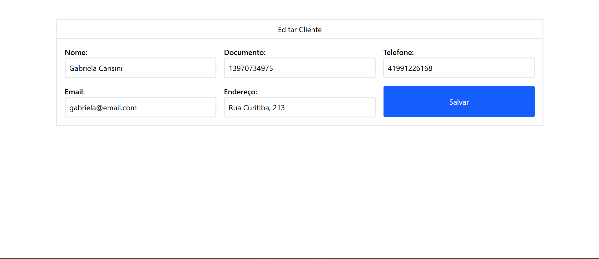
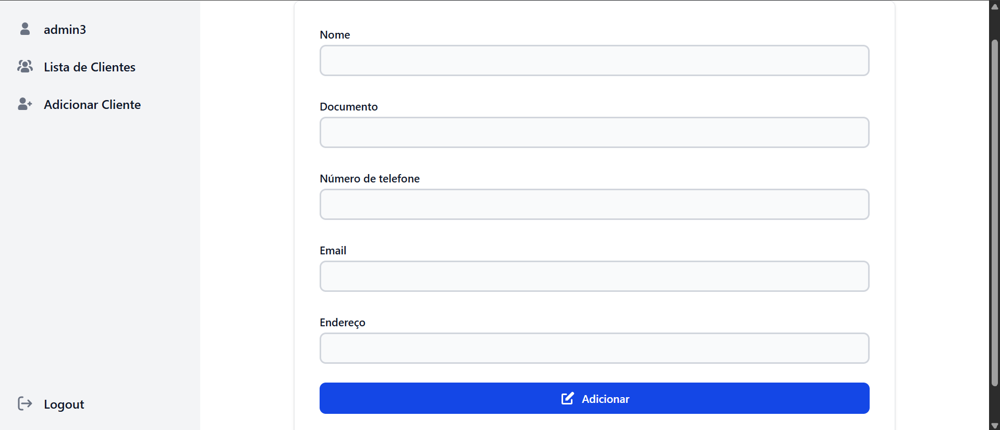
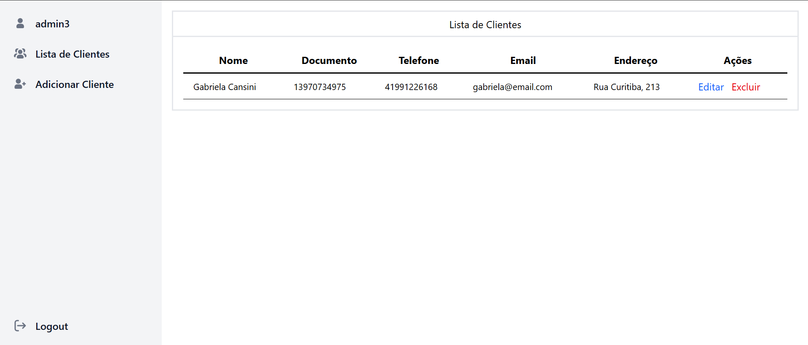

# Sistema de Gerenciamento de Clientes

Este projeto é um sistema simples de gerenciamento de clientes, onde um usuário pode adicionar, editar, listar e excluir clientes. Foi desenvolvido em PHP, utilizando o MySQL como banco de dados e o Tailwind CSS para o design das interfaces.

## Funcionalidades

- **Cadastro de Clientes**: O usuário pode adicionar novos clientes ao sistema, informando nome, documento, telefone, email e endereço.
- **Edição de Clientes**: O usuário pode editar as informações de um cliente existente.
- **Exclusão de Clientes**: O usuário pode excluir um cliente do sistema.
- **Lista de Clientes**: Exibição de todos os clientes cadastrados no banco de dados.
- **Autenticação de Usuário**: O sistema exige login para acessar as funcionalidades de gerenciamento de clientes.

## Tecnologias Utilizadas

- **PHP**: Linguagem de programação utilizada para a lógica de back-end.
- **MySQL**: Banco de dados relacional utilizado para armazenar as informações dos clientes e usuários.
- **Tailwind CSS**: Framework CSS utilizado para estilizar o front-end de maneira rápida e responsiva.
- 

## ScreenShots

